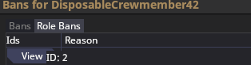

# Basic Commands

> [!NOTE]
> For an overview of admin menus and verbs, check out the [upstream Admin Tooling docs](https://docs.spacestation14.com/en/community/admin/admin-tooling.html)

## De-/Activating Admin privileges
### readmin
|Syntax|Description|
|:-------|:-----------|
| ``readmin`` | Enable your admin privileges. |

### deadmin
|Syntax|Description|
|:-------|:-----------|
| ``deadmin`` | Disables your admin privileges to play like normal. |

### aghost
|Syntax|Description|
|:-------|:-----------|
| ``aghost`` | Turns you into a fancy ghost with an inventory that can interact with the live round. |


## Gathering information
### adminlogs
|Syntax|Description|
|:-------|:-----------|
| ``adminlogs`` | Opens the floating logs window.|

### adminoverlay
|Syntax|Description|
|:-------|:-----------|
| ``adminoverlay <bool>`` | Alternative to clicking the toggle overlay button in the F7 player menu. |

### listgamerules
|Syntax|Description|
|:-------|:-----------|
| ``listgamerules`` | This command will print a list of currently active game rules, allowing you to see previous spawns and the current game mode at a glance. |

- If the ``RampingStationEventScheduler`` is present, the game mode is Survival.
- If the ``BasicStationEventScheduler`` is present, you can identify the gamemode by antag-specific gamerules such as ``Nukeops`` or ``Traitors``.
- Some round-start antagonists don't roll immediately; the respective game rules will be shown as ``[PENDING]`` until the roles are filled.

### lsobjectives
|Syntax|Description|
|:-------|:-----------|
| ``lsobjectives <username>`` | Prints the antagonist objectives of the requested player to your console.|

### menuvis
|Syntax|Description|
|:-------|:-----------|
| ``menuvis [mode]`` | Allows you to make items inside of containers visible to you in the context menu.|

- Use ``menuvis ALL`` to view inside closed lockers and other containers by right-clicking.
    * Watch out, people are containers too and you can take out their organs as an aghost!
- Use ``menuvis`` without any arguments to go back to normal.

## Moderation
### adminnotes
|Syntax|Description|
|:-------|:-----------|
| ``adminnotes <username>`` | Opens the note menu on the specified user |

### ban_exemption_update
|Syntax|Description|
|:-------|:-----------|
| ``ban_exemption_update <username> <flag>`` | Exempt an account from specific kinds of bans. |
- Flag ``IP``: Used to exempt someone from a non-VPN IP Ban. Use this if they are affected by another player's ban.
- Flag ``Datacenter``: Used to exempt someone from VPN/Datacenter bans.

### rename
|Syntax|Description|
|:-------|:-----------|
| ``rename <username> <new character name>`` | Used to properly rename a player mid-round. |

### playerpanel
|Syntax|Description|
|:-------|:-----------|
| ``playerpanel <username>`` | Opens the player panel for the specified user, containing shortcuts to various menus. |
- Keep a playerpanel open on suspected raiders, it'll allow you to react much quicker by just clicking the freeze button.

### banlist
|Syntax|Description|
|:-------|:-----------|
| ``banlist <username>`` | Opens a player's ban list. |
- By clicking on view, you can display a tooltip with the ID of each ban and other metadata.
  - Do not share the data shown to you in this tooltip, it contains PII.
  

### pardon
|Syntax|Description|
|:-------|:-----------|
| ``pardon <ban id>`` | Pardons a specific Server Ban. |
- get the ban ID from the [ban list](#banlist)

### roleunban
|Syntax|Description|
|:-------|:-----------|
| ``roleunban <ban id>`` | Pardons a specific Server Ban. |
- get the ban ID from the [ban list](#banlist)

## Addressing Bugs
### setmind
|Syntax|Description|
|:-------|:-----------|
| ``setmind <username> <entity ID>`` | Use this to force a player to take control of a certain (sentient) entity. Useful if Psionics sent someone to nullspace again or ghosted them. |

### spawnplayer
|Syntax|Description|
|:-------|:-----------|
| ``spawnplayer <username>`` | Spawn the given player's current character at your aghost's position. |
- Use this if you can't teleport someone out of nullspace after deleting their old body. You may need to use setmind to force them in.

### griddrag
> [!WARNING]
> Don't forget to turn griddrag off after using it! There's no indicator that it's enabled and you won't see the grid you're on moving as you're moving with it.
> If you forget to disable it, you'll probably end up janking around the station and disrupting the round.

|Syntax|Description|
|:-------|:-----------|
| ``griddrag`` | Toggles grid dragging. |
- Use this to drag stuck grids away from each other, such as a salvage wreck out of the LPO outpost.
- After executing the command to enable dragging, simply click on the grid you want to pull and hold. You can drag it with your mouse.
- The grid will gain velocity, move your mouse slowly until it's unstuck.
- Execute it again to disable it.


## Eventing

### delaystart
|Syntax|Description|
|:-------|:-----------|
| ``delaystart <delay in seconds>`` | Used to delay the start of the round |
- You probably shouldn't use this frequently or without reason, such as to wait for more players before an event shift or after a server crash.


### addgamerule
|Syntax|Description|
|:-------|:-----------|
| ``addgamerule <gamerule>`` | Used to add game rules to the current round. These range from antag spawns to noospheric events. |

### addaction
|Syntax|Description|
|:-------|:-----------|
| ``addaction <entity id> <action prototype>`` | Used to grant entities the ability to perform special actions such as ActionFireball - ONI'SOMA! |

### loadgrid
|Syntax|Description|
|:-------|:-----------|
| ``loadgrid <map id> <grid file> <x> <y>`` | Used to spawn in grids such as shuttles. |
- Fly far enough away from the station. If you are too close, the grid might intersect and disrupt the round.
- Open the F3 Menu to get the required values from the debug menu. They'll be in the topmost block of text.

  
- The grid file parameter should autocomplete, just start by typing ``/Maps/`` and you'll be able to explore the collection of grids/maps.
- Using the values from the above image, I could spawn in a recruiter shuttle at the location of my aghost as follows:
  ```
  loadgrid 4 /Maps/_DV/Shuttles/Admin/recruiter_ship.yml 964 273
  ```

### spawncharacter
|Syntax|Description|
|:-------|:-----------|
| ``spawncharacter <character name> <loadout>`` | Used to spawn in one of your own characters with the specified loadout. |
- Use this to spawn your CC character with the ``CentralCommandOfficial`` loadout.

## Miscellaneous
### list
|list|Description|
|:-------|:-----------|
| ``list <keyword>`` | Search for commands by the specified keyword. |

### help
|list|Description|
|:-------|:-----------|
| ``help <command>`` | Display the specified command's documentation, if it exists. YMMV. |


### toggleshadows
|Syntax|Description|
|:-------|:-----------|
| ``toggleshadows`` | Will toggle rendering of shadows client-side. |
- Less straining on the eyes than fullbright while still allowing you to see clearly in most situations.
- Remember to turn this back off before you deadmin to play a ghost role. It won't be disabled automatically.

### setadminooc
|Syntax|Description|
|:-------|:-----------|
| ``setadminooc <hex color>`` | Sets the color of your ghost and OOC messages. |
- This will persist, you only need to set it once.

### fuckrules
|Syntax|Description|
|:-------|:-----------|
| ``fuckrules`` | Use this to skip the rules screen that pops up on join. |

