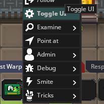
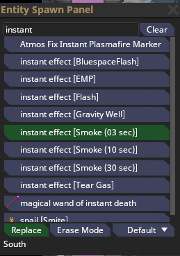

# Responding to Prayers and Faxes 

## Faxes
- If someone sents a fax to Central Command, you will receive the following notification in admin chat and hear a printing sound effect.

  
- Warp to CC using ``warp Centcomm`` to take a look at the fax.
- Instead of spawning in your CC character for each announcement, you can simply take the ID out of your Admin PDA and set it to your character's name; it works just like an Agent ID, allowing you to announce while staying aghosted.

   

### Spawning in as CC anyway
- In some situations, you may want to holocall the station. Or perhaps you just prefer doing things as an actual character.
  You can spawn in your CC character using ``spawncharacter <character name> CentralCommandOfficial`` 

## Prayers
- If someone prays, you will receive a notification like this in admin chat:

  
- Teleport to them using ``tpto <username>`` to see if they're offering anything in exchange or engaging in roleplay. It may make you reconsider answering their prayer.
- If you decide to answer their prayer by spawning something, you can place it in a smoke cloud or bluespace flash for dramatic effect. You can spawn these effects using the Entity panel, opened using F5. Search for "instant" and they should appear; they're spawned by clicking like any other entity, though you won't see a preview.
  
  

> [!WARNING]
> The range on the Gravity Well instant effect is very large, able to affect all of your admin area if placed in its center. You probably shouldn't use it in response to a prayer.
