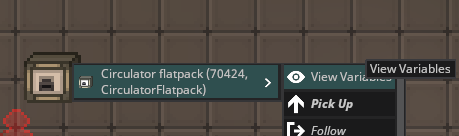
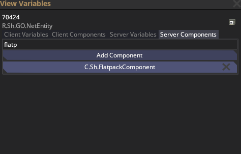
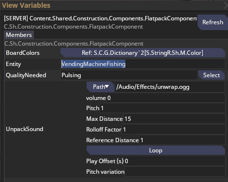
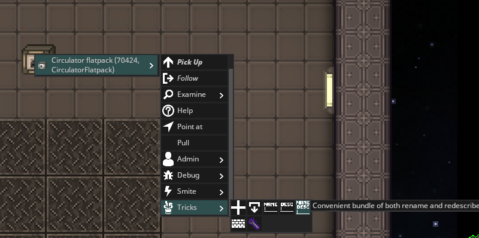
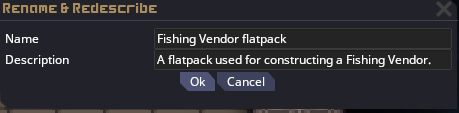

# Arbitrary Flatpacks

You can create flatpacks any Entity. This can, for example, be used for answering faxes or chelps asking for specific vendors that weren't mapped.

1. Spawn any flatpack using the F5 panel, then open VV on it.
  

2. Find the FlatpackComponent and open it
  

3. Set the Entity attribute to whichever Entity you want to be spawned.
  

4. Rename and redescribe it using the verb under Tricks
  
  

