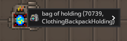
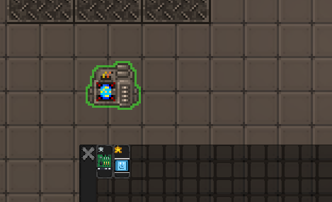
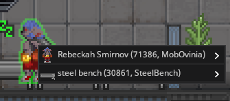
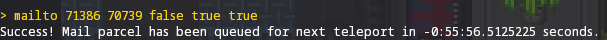
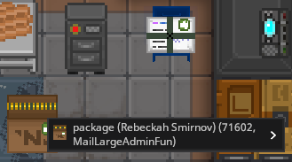
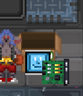

# Sending Custom Mail

1. Spawn a storage container in your admin area. In this case, I'll be using a bag of holding. Take note of its Entity ID.
   
   
2. Put everything you want shipped into the container. It can be multiple items at the same time.
   

   
3. Find the entity ID of the character you want to send them to.
   
   
4. Execute the command as follows:
   ```
   mailto <recipient id> <container id> <fragile?> <priority mail?> <large?>
   ```
   - Large mail is shipped in packages
   - Continuing with our example, I'll run the following: 

     
   - The package will be spawned at the mail teleporter to be delivered by the couriers
     
     
