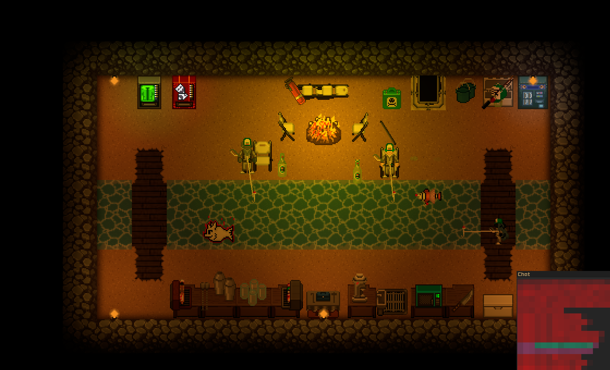
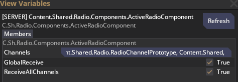

# Station Comms in a Ghost Bar
> [!WARNING]
> Don't give ghost bar patrons access to station comms, they will be able to send messages to the station.
> This is meant to be used to give your character at a ghost bar or other admin area event access to comms, so you can keep track of what is happening on station. 

## Why?
After a building a ghost bar, you may find yourself wanting to join in and interact with some of the ghosts there. Taking one of the Custom Roleplay Role slots you created will leave you unable to hear the station's comms, but you can modify your radio to listen in while making sure that nobody else can easily steal it while you're aghosted to take care of something.

## How?
1. Open View Variables on your radio.
2. Find the ActiveRadioComponent under Server Components set both ``GlobalReceive`` and ``ReceiveAllChannels`` to True
    - This will allow you to hear all comms channels

    
4. Add the UnremoveableComponent to it
    - This will stop anyone who tries to remove it.  
